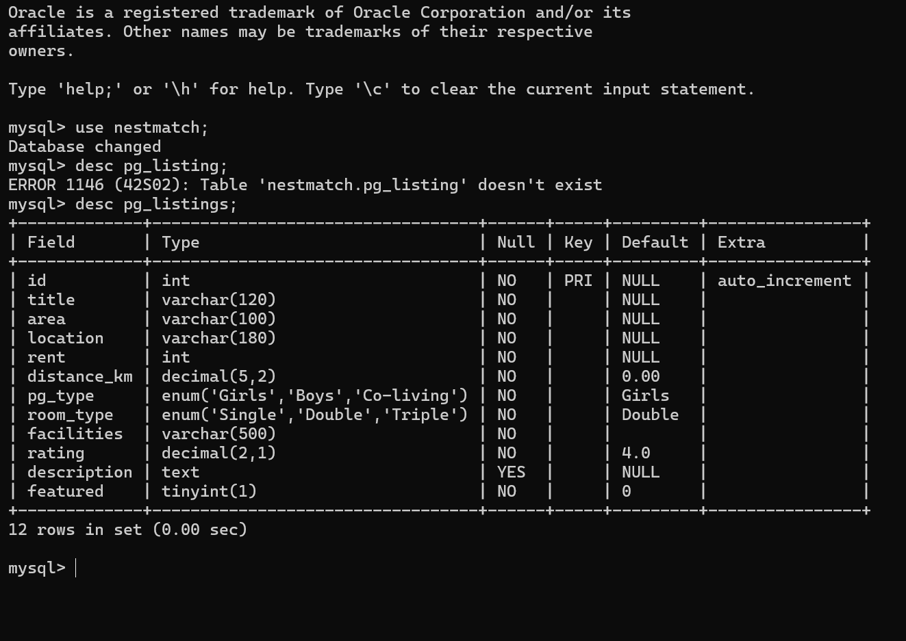
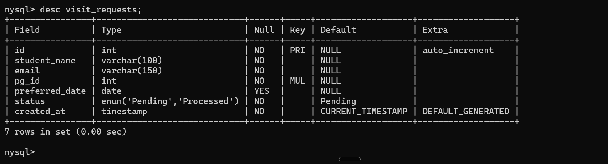

# NestMatch — Database Table Structures

## 1. PG Listings

The `pg_listings` table stores details of available PG accommodations, helping students find suitable options based on their preferences.

**Key Attributes:**
- `id` – Unique ID (Primary Key)
- `title` – PG name
- `area` and `location` – Location details
- `rent` – Monthly rent
- `distance_km` – Distance in kilometres
- `pg_type` and `room_type` – Accommodation categories
- `facilities`, `rating`, `description` – PG details

This table supports PG searching and filtering based on budget, location, room type, and facilities.

### Table Structure

## 2. Visit Requests

The `visit_requests` table stores the details of students requesting visits to selected PG accommodations.

**Key Attributes:**
- `id` – Unique request ID (Primary Key)
- `student_name` – Student's name
- `email` – Student's email address
- `pg_id` – ID of the selected PG
- `preferred_date` – Requested visit date
- `status` – Current request status
- `created_at` – Request creation date and time

**Purpose:** This table records and tracks student visit requests, which are managed using a FIFO (First In, First Out) queue.

### Table Structure

